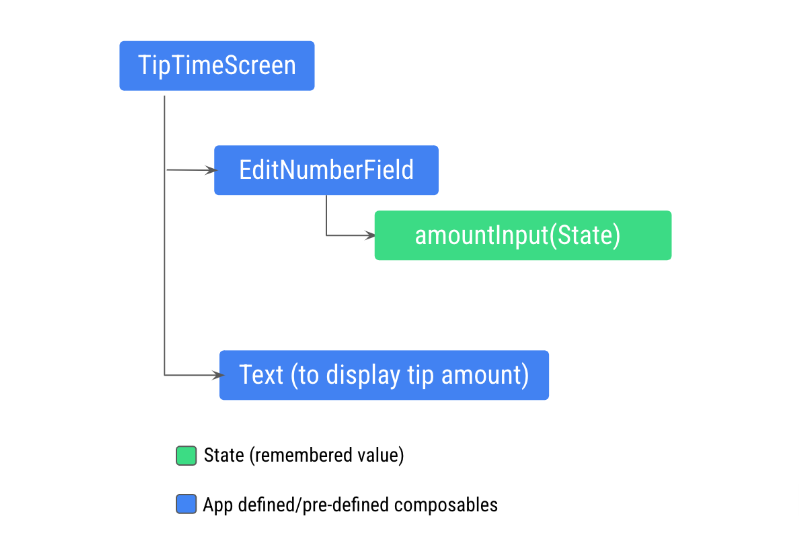
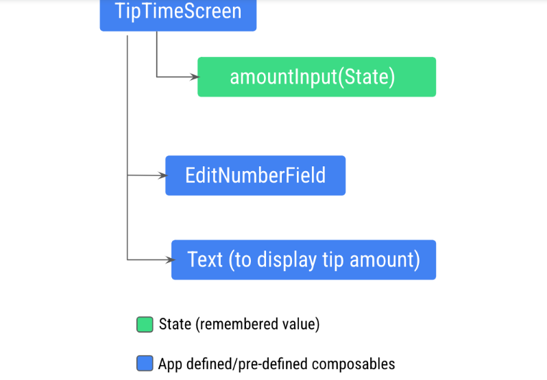

### Composición y Estados en Compose

[Codelab1](https://developer.android.com/codelabs/basic-android-kotlin-compose-using-state?continue=https%3A%2F%2Fdeveloper.android.com%2Fcourses%2Fpathways%2Fandroid-basics-compose-unit-2-pathway-3%23codelab-https%3A%2F%2Fdeveloper.android.com%2Fcodelabs%2Fbasic-android-kotlin-compose-using-state#0)

[Codelab2](https://developer.android.com/codelabs/basic-android-kotlin-compose-write-automated-tests?continue=https%3A%2F%2Fdeveloper.android.com%2Fcourses%2Fpathways%2Fandroid-basics-compose-unit-2-pathway-3%23codelab-https%3A%2F%2Fdeveloper.android.com%2Fcodelabs%2Fbasic-android-kotlin-compose-write-automated-tests#0)

La composición es una descripción de la IU que crea Compose cuando ejecuta 
elementos que admiten composición. Las apps de Compose llaman a funciones que 
admiten composición para transformar datos en IU.
Si se produce un cambio de estado, Compose vuelve a ejecutar las funciones
que admiten composición afectadas con el nuevo estado,
lo que crea una IU actualizada. Esto se denomina recomposición.
Compose programa una recomposición por ti.

Cuando Compose ejecute tus elementos que admiten composición por primera vez,
durante la composición inicial, mantendrá un registro de los elementos que
admiten composición a los que llamas para describir tu IU en un objeto Composition.
Una recomposición se genera cuando Jetpack Compose vuelve a ejecutar 
los elementos componibles que pueden haberse modificado en respuesta a 
cambios de estado y, luego, actualiza la composición para reflejar los cambios.

### Estados
Debes acceder a la variable __amountInput__ en la función __TipTimeScreen__ para 
calcular y mostrar el importe de la propina, pero la variable __amountInput__ 
es el estado del campo de texto definido en la función de componibilidad
__EditNumberField()__. Aún no puedes llamarlo desde la función 
__TipTimeScreen()__. En esta imagen, se muestra la estructura del código:

Esta estructura no te permitirá mostrar el importe de la propina en el nuevo elemento
Text que admite composición porque el elemento Text debe acceder a la variable 
__amount__ calculada desde la variable __amountInput__. Debes exponer la variable 
__amount__ a la función __TipTimeScreen()__. En esta imagen, se muestra la estructura 
de código deseada, lo que hace que el elemento __EditNumberField()__ 
que admite composición no tenga estado:

Este patrón se conoce como ___elevación de estado___.

## Elevación de Estado

En esta sección, aprenderás a decidir dónde definir tu estado de manera
que puedas volver a usar y compartir tus elementos que admiten composición.

En una función de componibilidad, puedes definir variables que muestren
el estado de la IU. Por ejemplo, definiste la variable __amountInput__ 
como estado en el elemento __EditNumberField()__ que admite composición.

Cuando tu app se vuelva más compleja y otros elementos que admitan 
composición necesiten acceder al estado dentro del elemento 
__EditNumberField()__ que admite composición, deberás considerar la elevación
o extracción del estado fuera de la función de componibilidad ___EditNumberField()__.

### Cómo interpretar los elementos que admiten composición con estado y sin estado
Debes elevar el estado cuando necesites hacer lo siguiente:
- Compartir el estado con varias funciones que admiten composición
- Crear un elemento sin estado que admite composición que se pueda volver a usar en tu app

Cuando extraes el estado de una función de componibilidad, la función de 
componibilidad resultante se considera sin estado. Es decir, las funciones
que admiten composición pueden dejar de tener estado si se lo extrae de ellas.

_Un elemento sin estado que admite composición no tiene estado, 
lo que significa que no tiene, define ni modifica un nuevo estado.
Por otro lado, un elemento con estado que admite composición es aquel 
que posee una parte de estado que puede cambiar con el tiempo._

> Nota: En apps reales, tener un elemento 100% sin elemento componible 
puede ser difícil de alcanzar según las responsabilidades del elemento. 
Debes diseñar tus elementos que admiten composición de modo que tengan 
la menor cantidad de estado posible y permitir que se eleve cuando convenga, 
exponiéndolos en la API del elemento que admite composición.

La elevación de estado es un patrón en el que el estado se mueve a una 
función diferente a fin de dejar a un componente sin estado.

Cuando se aplica a los elementos que admiten composición, esto suele
implicar incorporar dos parámetros a este elemento:

- Un parámetro `value: T`, que es el valor actual que se mostrará.
- Una lambda de devolución de llamada `onValueChange: (T) -> Unit`,
que se activa cuando cambia el valor para que el estado
se pueda actualizar en otro lugar, como cuando un usuario ingresa 
texto en el cuadro de texto

Eleva el estado en la función __EditNumberField()__:
1. Actualiza la definición de la función __EditNumberField()__ a fin 
de elevar el estado agregando los parámetros `value` y `onValueChange`.

~~~
fun EditNumberField(
   value: String,
   onValueChange: (String) -> Unit
)
~~~

El parámetro value es de tipo String y el parámetro __onValueChange__ 
es de tipo `(String) -> Unit`, por lo que es una función que toma un
valor String como entrada y no tiene valor de retorno. 
El parámetro onValueChange se usa como la devolución de llamada 
__onValueChange__ que se pasa al elemento TextField que admite composición.

2. En la función __EditNumberField()__, actualiza la función de
componibilidad __TextField()__ para usar los parámetros que se pasaron:
~~~
TextField(
   value = value,
   onValueChange = onValueChange,
   // Rest of the code
)
~~~

3. Eleva el estado, mueve el estado recordado de la función __EditNumberField()__
a la función __TipTimeScreen()__:
~~~
@Composable
fun TipTimeScreen() {
   var amountInput by remember { mutableStateOf("") }

   val amount = amountInput.toDoubleOrNull() ?: 0.0
   val tip = calculateTip(amount)

   Column(
       //...
   ) {
       //...
   }
}
~~~

4. Elevaste el estado a __TipTimeScreen()__ y, ahora, lo pasas a
__EditNumberField()__. En la función __TipTimeScreen()__, 
actualiza la llamada a la función __EditNumberField()__ 
para usar el estado elevado:

~~~
EditNumberField(value = amountInput,
   onValueChange = { amountInput = it }
)
~~~

5. Usa la propiedad tip para mostrar el importe de la propina.
Actualiza el parámetro __text__ del elemento que admite composición 
Text para usar la variable __tip__ como parámetro. 
Esto se denomina ___formato posicional___.
~~~
Text(
   text = stringResource(R.string.tip_amount, tip),
   // Rest of the code
)
~~~

Con el formato posicional, puedes mostrar contenido dinámico en strings.
Por ejemplo, imagina que deseas que el cuadro de texto __Importe de la propina__
muestre un valor __xx.xx__ que podría ser cualquier importe calculado
y con formato en tu función. Para lograr esto en el archivo strings.xml, 
debes definir el recurso de strings con un argumento de marcador de posición,
como este fragmento de código:
~~~
// No need to copy.

// In the res/values/strings.xml file
<string name="tip_amount">Tip Amount: %s</string>

// In your Compose code
Text(
    text = stringResource(R.string.tip_amount, tip)
)
~~~
Puedes tener varios marcadores de posición, y de cualquier tipo.
Un marcador de posición string es __%s__. 
En Compose, debes pasar la propina con formato como un argumento a la función
__stringResource()__.

Las funciones __TipTimeScreen()__ y __EditNumberField()__ completadas
deberían verse como este fragmento de código:
~~~
@Composable
fun TipTimeScreen() {
   var amountInput by remember { mutableStateOf("") }

   val amount = amountInput.toDoubleOrNull() ?: 0.0
   val tip = calculateTip(amount)

   Column(
       modifier = Modifier.padding(32.dp),
       verticalArrangement = Arrangement.spacedBy(8.dp)
   ) {
       Text(
           text = stringResource(R.string.calculate_tip),
           fontSize = 24.sp,
           modifier = Modifier.align(Alignment.CenterHorizontally)
       )
       Spacer(Modifier.height(16.dp))
       EditNumberField(value = amountInput,
           onValueChange = { amountInput = it }
       )
       Spacer(Modifier.height(24.dp))
       Text(
           text = stringResource(R.string.tip_amount, tip),
           modifier = Modifier.align(Alignment.CenterHorizontally),
           fontSize = 20.sp,
           fontWeight = FontWeight.Bold
       )
   }

}

@Composable
fun EditNumberField(
       value: String,
       onValueChange: (String) -> Unit
   ) {
   TextField(
       value = value,
       onValueChange = onValueChange,
       label = { Text(stringResource(R.string.cost_of_service)) },
       modifier = Modifier.fillMaxWidth(),
       singleLine = true,
       keyboardOptions = KeyboardOptions(keyboardType = KeyboardType.Number)
   )
}
~~~